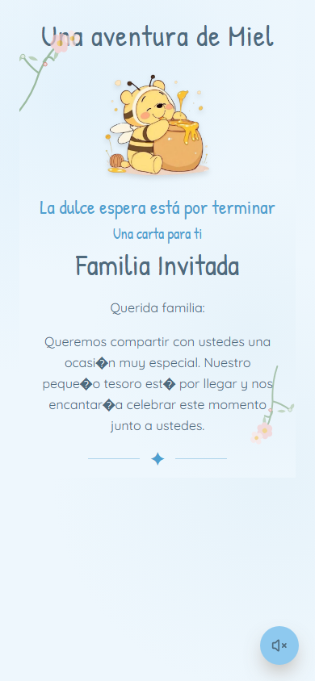
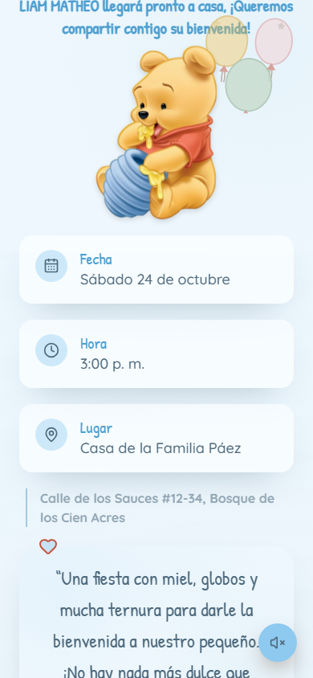
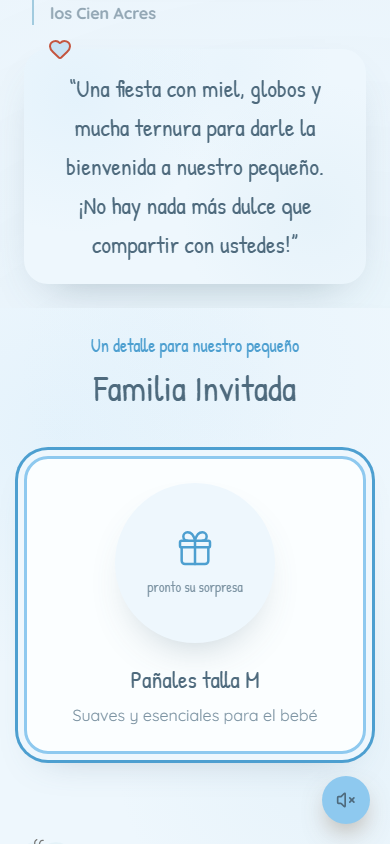
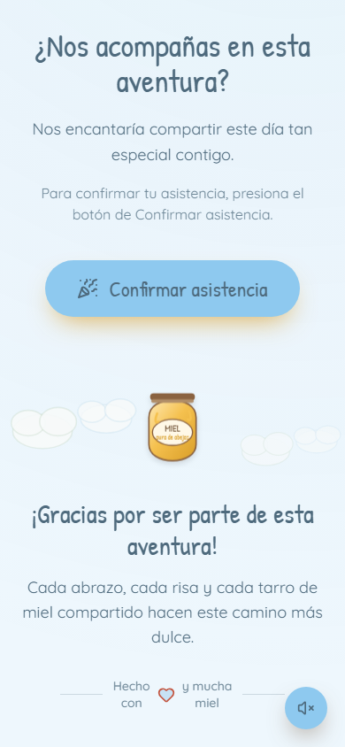
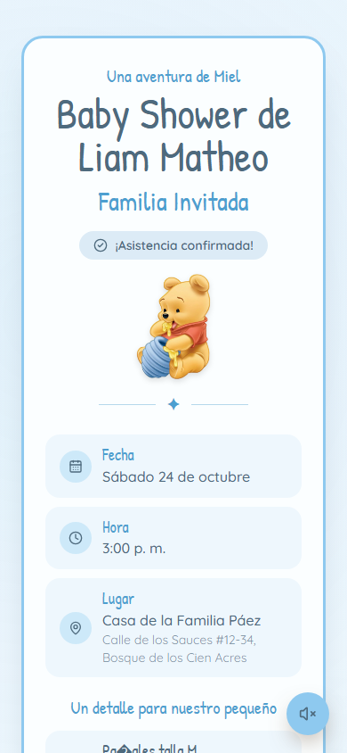
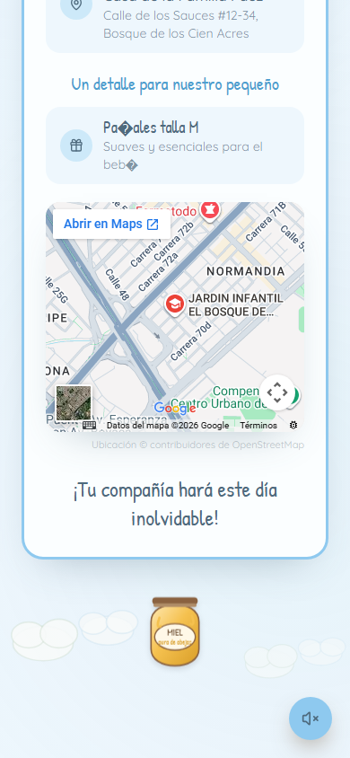
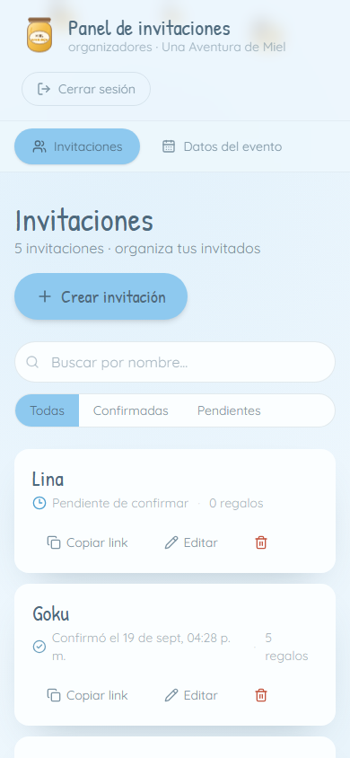
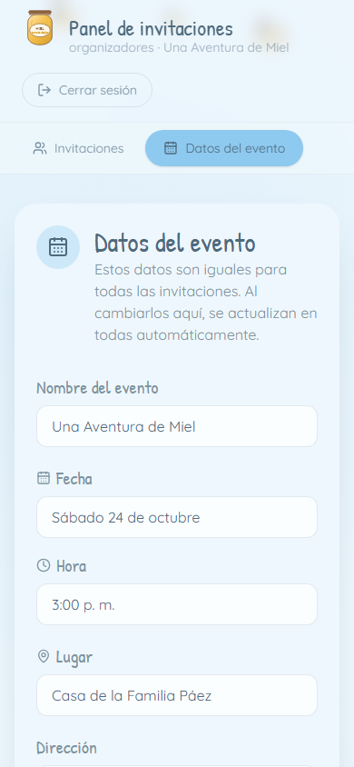
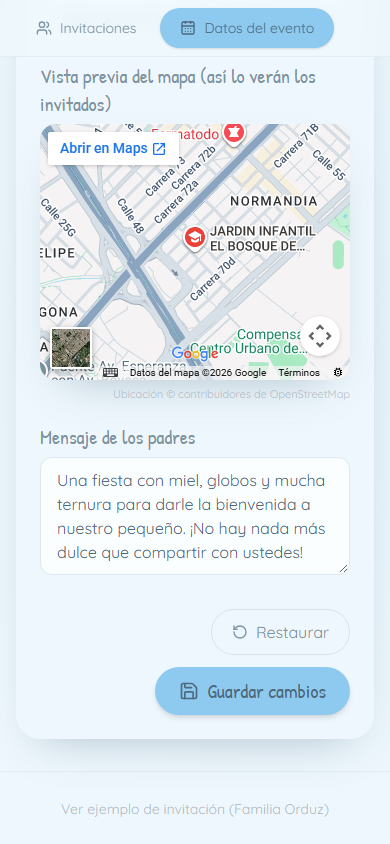

# Una Aventura de Miel — Invitaciones digitales de Baby Shower

Invitaciones digitales para el Baby Shower de Liam. Cada invitado recibe un enlace personalizado con los datos del evento, su regalo asignado y un botón para confirmar asistencia.

## Stack

- **Frontend**: React + TypeScript + Vite + Tailwind CSS + Framer Motion
- **Backend API**: Cloudflare Workers (TypeScript)
- **Base de datos + Auth**: Supabase (PostgreSQL + Auth)
- **Despliegue**: Cloudflare Workers Builds (CI desde GitHub, deploy automático por push a `main`)

## Estructura

```
backend/    Worker con la API (público + panel admin) y esquema de Supabase
frontend/   Aplicación React (invitación + panel de organizadores)
```

## Funcionalidades

- Invitación por enlace (`/invitacion/:slug`) con apertura de cortina, música de fondo y confirmación de asistencia.
- Tarjeta compacta para invitados que ya confirmaron, con fecha, hora, lugar, regalos y mapa de ubicación.
- Panel de administración (`/admin`) con login via Supabase Auth: gestiona invitaciones, regalos y datos del evento.
- Los datos del evento son globales y se editan una vez desde el panel.

## Vista previa

### Invitación antes de confirmar

| Cortinas | Carta personalizada |
| --- | --- |
|  |  |

| Detalles del evento | Regalos y mensaje |
| --- | --- |
|  |  |

| Confirmación y agradecimiento |
| --- |
|  |

### Invitación después de confirmar

Al confirmar, el invitado ve una tarjeta compacta con toda la información y el mapa de ubicación.

| Tarjeta confirmada | Mapa de ubicación |
| --- | --- |
|  |  |

### Panel de administración

| Invitaciones | Datos del evento |
| --- | --- |
|  |  |

| Vista previa del mapa en el panel |
| --- |
|  |

## Local

- **Frontend**: `cd frontend` → `npm install` → `npm run dev`
- **Backend**: `cd backend` → `npm install` → `npm run dev` (usa las credenciales de `backend/.dev.vars`)

Variables de entorno requeridas: `VITE_API_BASE_URL`, `VITE_SUPABASE_URL`, `VITE_SUPABASE_ANON_KEY` (frontend) y `SUPABASE_URL`, `SUPABASE_ANON_KEY`, `SUPABASE_SERVICE_ROLE_KEY`, `ALLOWED_ORIGIN` (backend).

## Despliegue

Cada `push` a `main` dispara un build y deploy automático de la API (root `backend`) y del front (root `frontend`) en Cloudflare Workers.